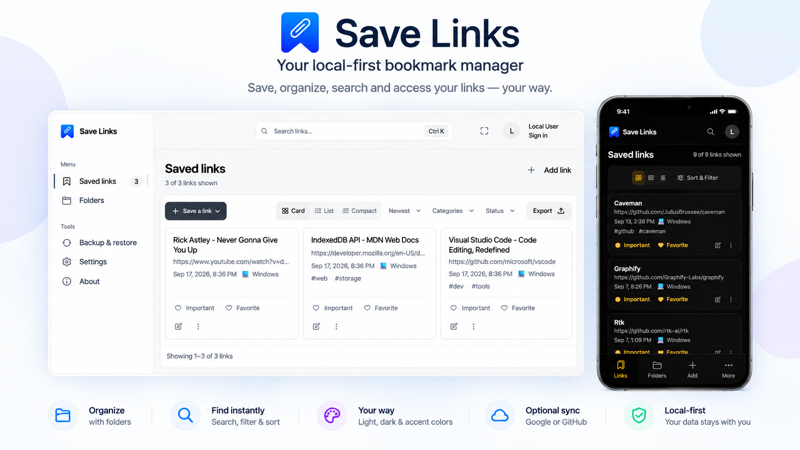
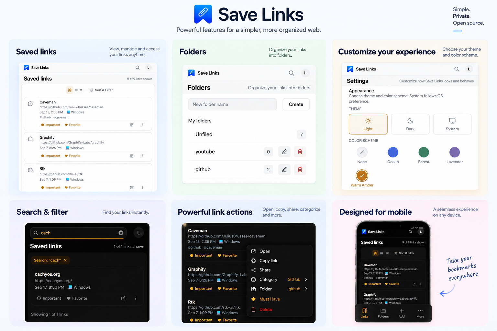

<p align="center">
  
</p>

<h1 align="center">Save_Links</h1>

<p align="center">
  A fast, local-first bookmark manager for saving, organizing, searching and syncing links - right in your browser.
</p>

<p align="center">
  
</p>

<p align="center">
  <a href="https://save-links.ucancallmesan.workers.dev"><b>Open the app</b></a>
  &nbsp;·&nbsp;
  <a href="#development">Run it locally</a>
  &nbsp;·&nbsp;
  <a href="#roadmap">Roadmap</a>
</p>

## What is Save_Links?

Save_Links is a browser-based bookmark manager that keeps your data on your device first:

- **Local-first** - links, folders, settings and your profile are stored in your browser's **IndexedDB**. Local use never uploads anything.
- **No account required** - the app is fully usable without signing in.
- **Works offline** - after one online visit the app shell is cached by a service worker, and adding, editing and deleting links keeps working without a connection.
- **Optional cloud synchronization** - sign in with Google or GitHub to synchronize links and folders across your browsers.
- **Installable PWA** - install it from the browser and use it like a desktop or mobile app.

## Features

- **Save links** with automatic metadata (title, description, preview image) when the site provides it, and full manual editing.
- **URL cleaning** - common tracking parameters are removed before saving.
- **Duplicate detection** - saving an existing link offers Replace existing / Add another / Cancel.
- **Folders** with live counts and an Unfiled group; move links between folders from the card menu.
- **Favorites, Important and Must Have** - per-link status flags; Favorites and Important are one-click card controls, Must Have lives in the card's quick-action menu.
- **Search** across titles, URLs, descriptions and tags, with the **Ctrl/⌘+K** shortcut.
- **Filters** by category, status and folder, shown as clearable chips.
- **Sorting** - Newest, Oldest, Title A-Z and Title Z-A.
- **Card, List and Compact** views.
- **Inline editing** from the card or row, without leaving the list.
- **Responsive UI** for desktop, tablet and mobile, including a compact mobile shell with a four-item bottom navigation.
- **Light, Dark and System** appearance, plus accent color schemes (None, Ocean, Forest, Lavender, Warm Amber).
- **Backup and restore** with JSON export/import.
- **Google and GitHub sign-in** with optional **cloud synchronization**, including **Sync & Merge** for existing local data and a **Keep Local** option.

## Feature showcase

An overview of the main features - saved links, folders, appearance settings, search and filtering, link actions, and the mobile layout.

<p align="center">
  
</p>

## Local-first and privacy

- **Local use** stores all data locally in your browser's IndexedDB. No data leaves your device.
- **Authenticated cloud synchronization** sends supported synchronized data (links and folders) to the cloud so it can be accessed across your browsers. It is **optional** - you can use Save_Links completely without an account.
- **Cloud synchronization is not a backup.** It is a synchronization service. For backups, use the application's export/backup functionality.
- **No analytics or telemetry.** Save_Links does not collect usage data.
- The production site is only where the app comes from; it is not a backend, and no data is uploaded to it during local use.
- **Offline.** After a first visit online, the app shell is cached by your browser, and Save_Links keeps working without a connection, including adding, editing, and deleting links.
- **One optional external request.** When you save a URL, your browser may ask that website for its title, description, and preview image. Some websites block this, in which case the link is saved with just what you entered.
- **Backups are your safety net.** Clearing your browser's data removes your saved links, so export a backup first if you want to move or protect them.

## Cloud synchronization and authentication

Sign-in and cloud synchronization are live in the production application at **https://save-links.ucancallmesan.workers.dev**:

- **Google OAuth** - primary provider; `/auth/google/login`, `/auth/google/callback`
- **GitHub OAuth** - `/auth/github/login`, `/auth/github/callback`
- **Session management** - `/api/me`, `/auth/logout`
- **API boundary** - `/api/me` (read), `POST /api/session/refresh` (rotate session)
- **Sync & Merge** - after signing in, existing local data can be merged with your account
- **Keep Local** - keeps your local data on this device only, marks it as "kept local" so it won't prompt again, and does not upload it to the cloud

The local application works completely without authentication. **Email login is not yet supported.**

### Security

- PKCE, signed single-use OAuth state, and an approved-origin allowlist
- Session token hashing, HttpOnly cookies, and session rotation
- Rate limiting on authentication and API endpoints

## Backup and restore

All your data can be exported to a JSON file and imported again later - which is also how you move your links between browsers or machines. Backups made by older versions of Save_Links can still be imported.

**Cloud synchronization is not a backup.** Use export/import for backups.

## Feature details
### URL Cleaning

When you save a link, common tracking parameters are removed while normal functional parameters are kept. One example:

Original:
https://example.com/article?id=123&utm_source=newsletter&utm_campaign=spring

Saved:
https://example.com/article?id=123

### Duplicate Links

If the cleaned URL you are saving is already in your collection, Save_Links lets you choose:

- **Replace existing** — update the saved link with the new details
- **Add another** — keep both copies
- **Cancel** — save nothing

The original URL you entered is still shown, while the saved navigation URL is the cleaned one.

### Metadata

Save_Links saves your link immediately, so metadata never delays saving. Title, description, and preview image are filled in when a site provides usable information, and retrieval happens in the background when needed. Some websites do not allow their page information to be read, so the title, description, or preview image may not always be available. The link is still saved either way, and you can edit any of these fields yourself.

### Sorting

You can reorder the list of saved links to suit how you like to work:

- **Newest first** — the most recently saved links appear at the top (the default)
- **Oldest first** — the longest-saved links appear at the top
- **Title A–Z** — alphabetical by title, ignoring capital letters
- **Title Z–A** — reverse alphabetical by title

Sorting works together with search, filters, and folders — it reorders only the links currently shown, and it never changes where your links are stored.

## Stable vs development

- **Stable** - the latest **released** version. The current stable release is **v2.2.0**, hosted on **Cloudflare Workers** at **https://save-links.ucancallmesan.workers.dev** - just open the address; there is nothing to install.
- **Development** - the latest unreleased code on the `master` branch, for testing upcoming work or contributing. It may contain unfinished features, bugs, or breaking changes, and there is currently **no permanent public development URL** - developers run it locally (see [Development](#development)).
- `master` is not a release; new work lands there between releases.

## Development

### Prerequisites

- Node.js
- npm
- Git

### Run locally

```bash
git clone https://github.com/santosh000/Save_Links.git
cd Save_Links
npm install
npm run dev
```

The dev server is available at `http://localhost:5173` by default.

### Other useful commands

- `npm test` - run the unit tests
- `npm run test:e2e` - run the end-to-end browser tests
- `npm run build` - create a production build in `dist/`
- `npm run preview` - preview the production build locally

### Tech stack

Save_Links is built with **Vue 3** and **Vite**, stores data in the browser's **IndexedDB**, and uses a **service worker and PWA manifest** for installation and offline support. Unit tests use **Vitest**, and end-to-end tests use **Playwright**.

Authentication and cloud synchronization use **Cloudflare Workers**, **D1 (SQLite)**, and **OAuth (Google primary, GitHub)**.

## Development with OpenCode

Save_Links is developed with OpenCode as an AI-assisted development tool. Project-specific development instructions, architecture notes, and workflow guidance are maintained in `.opencode/`. Changes are validated with automated unit, end-to-end, and build checks.

## Roadmap

### Completed

- [x] Save, organize, search, and filter links
- [x] Folders with live counts
- [x] URL cleaning of common tracking parameters
- [x] Duplicate detection with Replace / Add another / Cancel
- [x] Background metadata (title, description, preview image)
- [x] Sorting saved links (Newest first, Oldest first, Title A–Z, Title Z–A)
- [x] Backup and restore, including older backup formats
- [x] Offline use, installation, and safe migration of older data
- [x] Responsive desktop, tablet, and mobile layouts
- [x] GitHub OAuth authentication
- [x] Google OAuth authentication
- [x] Session management with rotation
- [x] Authenticated API boundary (`/api/me`, `POST /api/session/refresh`)
- [x] Rate limiting on authentication and API endpoints
- [x] Cloud bookmark synchronization (create, update, delete)
- [x] Cross-browser synchronization
- [x] Sync & Merge for local data after login
- [x] Keep Local option

### Future

Planned (local improvements):

- [ ] Smart tag suggestions
- [ ] Improved metadata coverage and a way to refresh it
- [ ] Link health checking
- [ ] Bulk actions

Later (enhancements):

- [ ] Email/password sign-in

## License

Save_Links is released under the MIT License. See [LICENSE](LICENSE).
