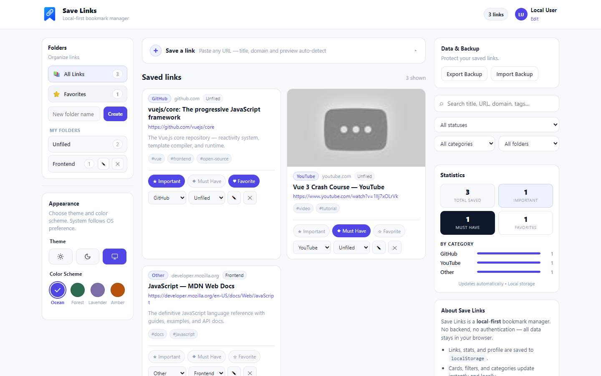

<p align="center">
  
</p>

<h1 align="center">Save_Links</h1>

<p align="center">
  A fast, local-first bookmark manager for saving, organizing, searching, and backing up your links.
</p>

<p align="center">
  
</p>

## Overview

Save_Links is a lightweight bookmark manager that runs entirely in your browser. Every bookmark you save lives on your device — there is no server, no account, and no cloud dependency. Paste a link and Save_Links takes care of the details: it normalizes the URL, fetches page metadata when it can, and organizes what you save into folders and categories so your links stay easy to find.

## Features

- **Save links** — add a bookmark in seconds; the URL is validated and normalized automatically
- **Automatic URL/source metadata handling** — title and description are fetched best-effort when available (never blocks saving)
- **Automatic categorization where currently supported** — domains like GitHub, YouTube, X/Twitter, Amazon, and others are tagged automatically; everything else falls into "Other"
- **Folders** — keep related links together; folders show live counts and can be reorganized at any time
- **Favorites** — mark links you want quick access to
- **Important** — flag links that matter most
- **Must Have** — separate the links you can't live without
- **Search** — full-text search across every saved link
- **Filtering** — combine filters by flag (important, must have, favorites), category, and folder
- **Backup/export** — export all data to a JSON file
- **Import/restore** — restore from a backup file later, with validation, migration of older formats, and sanitization of untrusted fields
- **Light/Dark/System appearance** — switch appearance freely; the choice persists across visits
- **Four color schemes** — change the accent color to match your taste
- **Local-first storage** — every change is written instantly to your browser's storage; a page reload always reflects the latest state

## App Preview

Save links quickly with automatic metadata and keep everything organized in one place.

<p align="center">
  
</p>

## Getting Started

### Prerequisites

- Node.js
- npm
- Git

### Run locally

```bash
git clone https://github.com/santosh000/Save_Links.git
cd Save_Links
npm install
npm run dev
```

The dev server is available at `http://localhost:5173` by default.

## 🗺️ Roadmap

- [x] Local-first link management
- [x] Folders and organization
- [x] Search and filtering
- [x] Backup and restore
- [ ] User authentication
- [ ] Backend integration
- [ ] Cloud synchronization

## Tech stack

- **Vue 3** (Composition API, `<script setup>`)
- **Vite** for the dev server and production builds
- **Vitest + jsdom** for unit tests
- **Playwright** for browser end-to-end tests (runs against Chrome)

## Scripts

| Script | Description |
| ------ | ----------- |
| `npm run dev` | Start the Vite dev server |
| `npm test` | Run the unit test suite |
| `npm run test:e2e` | Run the Playwright end-to-end suite (uses a dedicated test server on port 5173) |
| `npm run build` | Create a static production build in `dist/` |
| `npm run preview` | Preview the production build locally |

## Storage & privacy

- All data is stored locally in your browser under namespaced keys (separate per environment), and nothing is sent anywhere — no analytics, no telemetry, no accounts.
- The only external request is the optional, best-effort metadata fetch for a URL you explicitly paste; metadata extraction happens client-side in your browser.
- Clearing browser storage (or using a fresh profile) starts the app empty — use Backup & restore to move your data between browsers or machines.