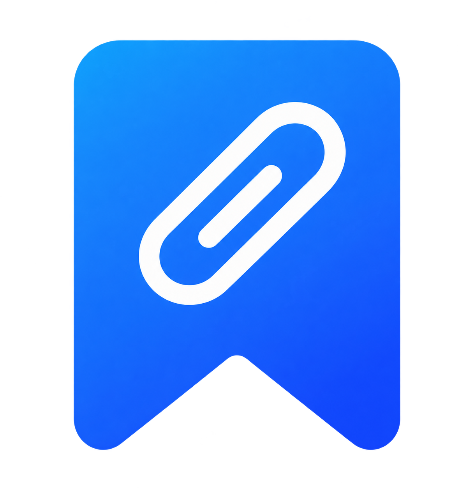
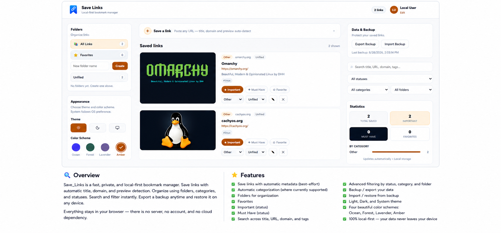
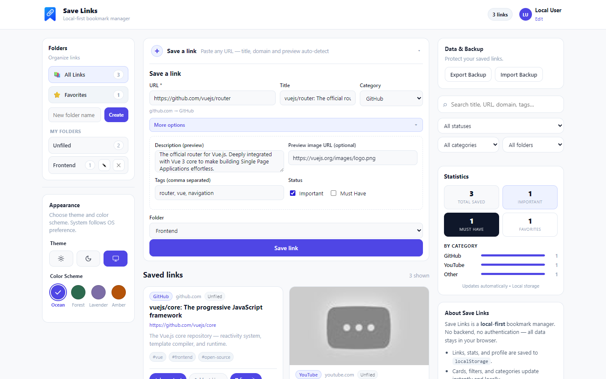

<p align="center">
  
</p>

<h1 align="center">Save_Links</h1>

<p align="center">
  A fast, local-first bookmark manager. Save links, clean common tracking parameters, catch duplicates, and fill in titles and preview images when a site provides them — all in your browser.
</p>

<p align="center">
  
</p>

## Stable vs Development Builds

Save_Links is under active development: the `master` branch always carries the latest unreleased work.

| | Stable | Development |
| --- | --- | --- |
| Recommended for | everyday, reliable use | previewing and testing the latest work |
| Contains | verified, released features | the latest work in progress |
| May contain | — | unfinished features, bugs, or breaking changes |

- **Stable** — the latest **released** version. Use it if you simply want to use Save_Links. The current stable release is v2.0.2, available at **https://savelinks.pages.dev** — just open the address; there is nothing to install. Features on the `master` branch are not part of v2.0.2 and are not released yet.
- **Development** — the latest **unreleased** code on the repository's `master` branch. Use it if you want to test upcoming work or contribute to the project. It may contain unfinished features, bugs, or breaking changes, and there is currently **no permanent public development URL** — developers and testers run it locally (see [Development](#development)). Temporary Cloudflare preview deployments may be created when specifically needed for testing; they are not permanent and are never created automatically.

Save_Links is hosted on Cloudflare Pages. The stable version is available at savelinks.pages.dev.

## What Save Links Does

Save_Links is a bookmark manager that lives in your browser. There is no server, no account, and no cloud database — your links stay on your device. Paste a link and Save_Links cleans common tracking parameters, catches duplicates, fetches a title, description, and preview image when the site allows it, and lets you organize your links into folders and categories.

Save_Links is a Progressive Web App, so once you have opened it online it also works offline: links can still be added, edited, and deleted without a connection. Data saved by very old versions of the app is migrated automatically on first launch, so nothing is lost.

## Features

- **Save links** — paste a URL and save a bookmark in seconds
- **Automatic metadata** — title, description, and preview image are filled in when the site provides them; saving is never blocked
- **Duplicate detection** — if the cleaned URL is already saved, you can replace the existing link, add another copy, or cancel
- **Automatic categories** — known sites (GitHub, YouTube, X/Twitter, Amazon, and others) are tagged automatically; everything else falls into "Other"
- **Folders** — keep related links together, with live counts; folders can be renamed, deleted, or reorganized at any time
- **Favorites, Important, Must Have** — mark links for quick access or priority
- **Search** — full-text search across every saved link
- **Filters** — combine filters by flag (important, must have, favorite), category, folder, and status
- **Sorting** — order your saved links by Newest first, Oldest first, Title A–Z, or Title Z–A
- **Appearance** — light, dark, or system theme with a choice of four accent colors; your preference is remembered
- **Installable app** — Save_Links can be installed on your device like a native app
- **Responsive layouts** — clean desktop, tablet, and mobile layouts; on smaller screens the folders and filters/tools panels open one at a time
- **Saves instantly** — every change is written immediately to your browser's storage, so a page reload always shows the latest state

## URL Cleaning

When you save a link, common tracking parameters are removed while normal functional parameters are kept. One example:

Original:
https://example.com/article?id=123&utm_source=newsletter&utm_campaign=spring

Saved:
https://example.com/article?id=123

## Duplicate Links

If the cleaned URL you are saving is already in your collection, Save_Links lets you choose:

- **Replace existing** — update the saved link with the new details
- **Add another** — keep both copies
- **Cancel** — save nothing

The original URL you entered is still shown, while the saved navigation URL is the cleaned one.

## Metadata

Save_Links saves your link immediately, so metadata never delays saving. Title, description, and preview image are filled in when a site provides usable information, and retrieval happens in the background when needed. Some websites do not allow their page information to be read, so the title, description, or preview image may not always be available. The link is still saved either way, and you can edit any of these fields yourself.

## Sorting

You can reorder the list of saved links to suit how you like to work:

- **Newest first** — the most recently saved links appear at the top (the default)
- **Oldest first** — the longest-saved links appear at the top
- **Title A–Z** — alphabetical by title, ignoring capital letters
- **Title Z–A** — reverse alphabetical by title

Sorting works together with search, filters, and folders — it reorders only the links currently shown, and it never changes where your links are stored.

## Backup and Restore

All your data can be exported to a JSON file and imported again later — which is also how you move your links between browsers or machines. Backups made by older versions of Save_Links can still be imported.

## Offline and Privacy

- **Offline.** After a first visit online, the app shell is cached by your browser, and Save_Links keeps working without a connection, including adding, editing, and deleting links.
- **Your data stays in your browser.** Saved links, folders, and settings are stored on your device. There is no account, no cloud database, and no synchronization.
- **No analytics or telemetry.** Save_Links does not collect usage data.
- **The website is just where the app comes from.** The app is served from savelinks.pages.dev; it is not a backend, and no data is uploaded to it.
- **One optional external request.** When you save a URL, your browser may ask that website for its title, description, and preview image. Some websites block this, in which case the link is saved with just what you entered.
- **Backups are your safety net.** Clearing your browser's data removes your saved links, so export a backup first if you want to move or protect them.

## App Preview

Save links quickly with automatic metadata and keep everything organized in one place.

<p align="center">
  
</p>

## Development

### Prerequisites

- Node.js
- npm
- Git

### Run locally

```bash
git clone https://github.com/santosh000/Save_Links.git
cd Save_Links
npm install
npm run dev
```

The dev server is available at `http://localhost:5173` by default.

### Other useful commands

- `npm test` — run the unit tests
- `npm run test:e2e` — run the end-to-end browser tests
- `npm run build` — create a production build in `dist/`
- `npm run preview` — preview the production build locally

### Tech stack

Save_Links is built with **Vue 3** and **Vite**, stores data in the browser's **IndexedDB**, and uses a **service worker and PWA manifest** for installation and offline support. Unit tests use **Vitest**, and end-to-end tests use **Playwright**.

## Roadmap

### Completed

- [x] Save, organize, search, and filter links
- [x] Folders with live counts
- [x] URL cleaning of common tracking parameters
- [x] Duplicate detection with Replace / Add another / Cancel
- [x] Background metadata (title, description, preview image)
- [x] Sorting saved links (Newest first, Oldest first, Title A–Z, Title Z–A)
- [x] Backup and restore, including older backup formats
- [x] Offline use, installation, and safe migration of older data
- [x] Responsive desktop, tablet, and mobile layouts

### Future

Planned (local improvements):

- [ ] Smart tag suggestions
- [ ] Improved metadata coverage and a way to refresh it
- [ ] Link health checking
- [ ] Bulk actions

Later (accounts and sync):

- [ ] Authentication
- [ ] Cloud backup
- [ ] Syncing across devices
- [ ] Desktop and mobile packaging

## License

Save_Links is released under the MIT License. See [LICENSE](LICENSE).